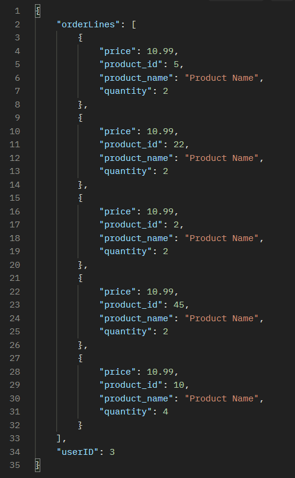

# Database_Exam
Group: 
- Tobias Linge Jensen, cph-tl233@cphbusiness.dk
- Mathias Brix Drejer, cph-md266@cphbusiness.dk
- Robert Pallesen, cph-rp154@cphbusiness.com

Database Video Presentation:

## Table of Contents
- [Folder Structure](#folder-structure)
- [Project Solution & Argumentation of Choices](#project-solution--argumentation-of-choices)
- [Database Diagram](#database-diagram)
- [Use cases](#use-cases)

## Folder Structure 

## Project Solution & Argumentation of Choices 

We have in this project decided to make a platform where a user can buy items in a webshop, The user should also get recommendation based on popular items. We have used an amazon Api to populate our database with current items in the Amazon webshop. 

In MSSQL, we leverage the power of a rigid schema to effectively manage our users, orders, and order lines. The structured nature of MSSQL ensures data consistency and integrity, enabling us to define a well-defined structure for our user table. This structure allows us to store essential customer details, including names and addresses. With a predefined schema, we can ensure that data is stored accurately and uniformly, preserving the integrity of user-related information.

MSSQL's ability to establish relationships between tables is crucial for managing order-related data. By utilizing tables such as orders and order lines, we can capture specific information related to each order. This includes unique order IDs, timestamps indicating when the orders were placed, and the products purchased by the customers. These relationships enable us to efficiently organize and retrieve order-specific data, providing valuable insights into our business operations.

Neo4j:
We’ve used Neo4j to handle all of our product data. Neo4j is designed to handle complex relationships between products, like categories, attributes, variations and recommendations. We can easily find related products and see how everything is connected. We combined all of this to fit our needs by using a Degreee centrality algorithm to find the most popular review to find recommended items. Neo4j enables us to grow our product catalog, we can spread our data on multiple servers to keep things running smoothly and handle more traffic. We can make real-time updates without messing up connections with our products. It makes sense for us to use Neo4j to store our data because we can create nodes representing products and connect them with relationships to product reviews. That way we are able to represent the complex relationships between products.

Redis:
We’ve used Redis as a database to store the Cart of a user when purchasing items. It’s a smart choice due to its in-memory nature. Redis provides fast read and write operation. For larger systems Redis scalability and high performance capabilities makes it suitable for handling large volumes of Cart Data and concurrent requests. Persistence options ensure that Cart information remains intact, even in case of server failures. 
Furthermore, Redis excels in caching frequently accessed Cart data, such as product details and prices. By caching this information in memory, subsequent access to the Cart becomes faster, reducing the load on the primary database and improving overall system performance.

## Database Diagram 
Redis Cart:

## Use cases 
- As a Customer, I want to buy products
- As a Customer, I want to be able to get recommendations based on popular items
- As a Customer, I want to be able to see all products
- As a Customer, I want to be able to add products to my Cart

# Installations
    pip install flask
    pip install neo4j
    pip install redis
    pip install pyodbc
    pip install python-dotenv
    pip install flask networkx
